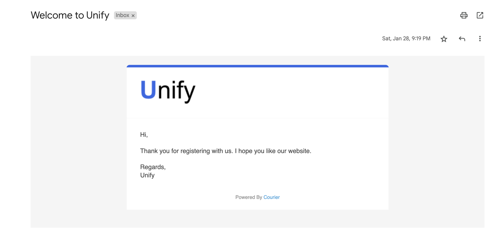
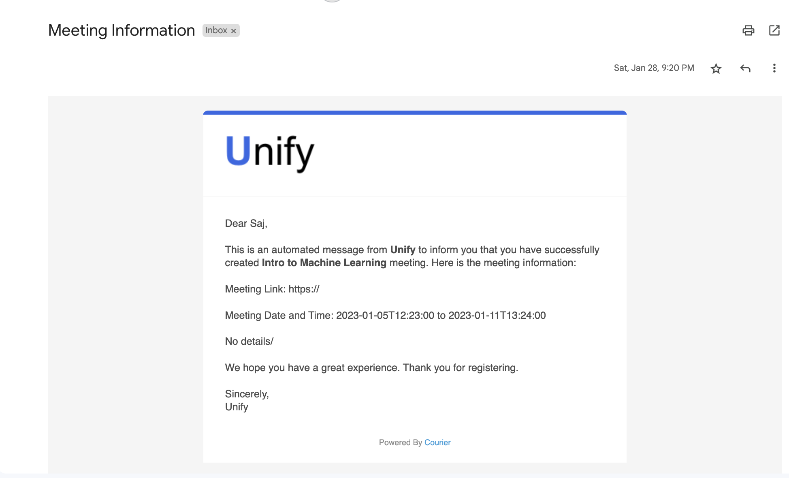
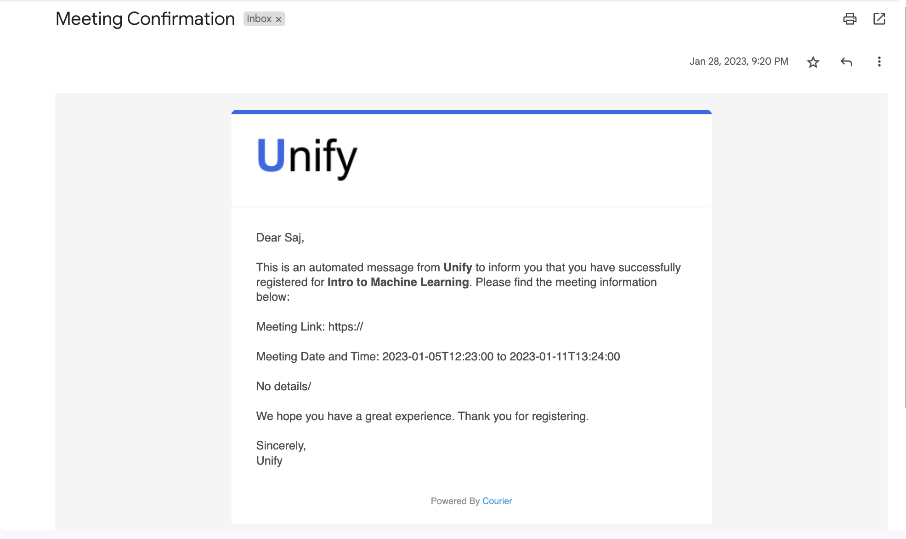
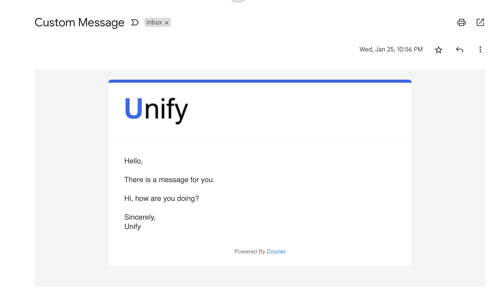
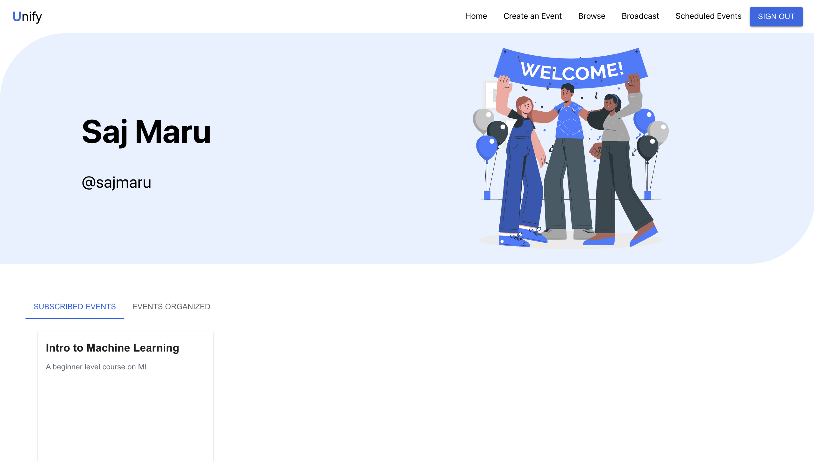
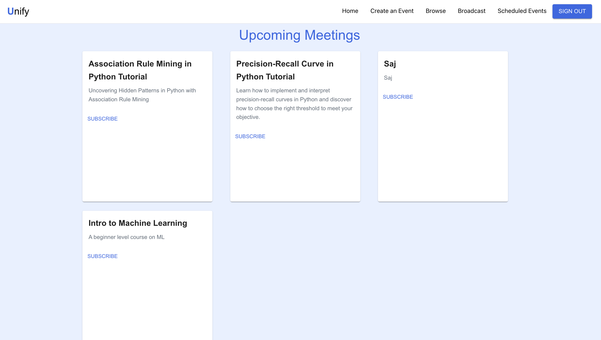
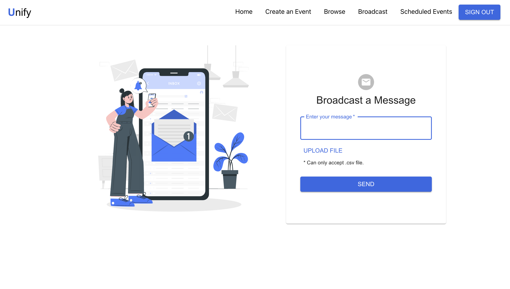

# Develop Unify a WebApp to host and attend virtual events with React.js, Flask, MongoDB and Courier API

  

## Background

  

Unify is an online platform that allows users to easily create and attend events. It is open to everyone, regardless of background or experience, and provides a great way to learn from and teach others. We have integrated a courier API in order to make sure that users are quickly notified of any system updates or changes. Through Unify, users can stay up-to-date with the latest happenings and get the most out of their events. All users are notified using Courier API once they sign up for the website, register for an event, notified my event organizer if needed. and we have also added a feature where admins and other registered users can notify mass of email IDs provided in any file format, and with an input of custom dynamic message for all users.

To build the application, we first designed the architecture and layout. We then used ReactJS to create the user interface and handle the front-end logic. Python was used to manage the back-end logic and server-side scripting, and FAST API was used to create the endpoints. MongoDB was used as the database to store data. After that, we went through an iterative process of testing and debugging until the application was ready.

## Instructions

### Part 1: Backend

List of APIs utilized in this project:

**Event**

| Name | Method | Description |
|--|--|--|
| create_event/ | POST | Create an Event|
| list_events/ | GET | Retrieve total events organized by all the users |
| list_organized_events/| GET | Retrieve all the events organized by the logged in user |
|  list_subscribed_events/| GET | Retrieve all the events the logged in user subscribed to |

**User**

| Name | Method | Description |
|--|--|--|
| create_user/ |  POST | Create a User|
| login/ | POST | Authenticate the user |
| organize_event/| GET | Create an event |
| subscribe_event/ | GET | Subscribe to an event | 

**File**

| Name | Method | Description |
|--|--|--|
| share/ | POST | Share the message to all the users provided in the file | 
  

### Part 2: Frontend

For the frontend we have used [MUI](https://mui.com/) to reuse some of the React.js components.


### Part 3: Database
 
We have used MongoDB for our database. Our database contains two tables - Events and Users.

Following are the screenshots of the two databases.

**Events Table**
  


**Users Table**


### Part 4: Courier API

We have utilized Courier API for following scenarios:

1. When user registers with our Website.



2. When user create an event.



3. When user subscribes for an event.



4. To broadcast a message to bunch of users



**For all the email notifications mentioned above we have created templates corresponding to each uses cases and supporting dynamic data.**

Following is the sample code in Python which is used to send a 'registration successful' message. Template field contains a template id which we have created via the Courier portal. It also contains a dynamic field 'message' which can accept customizable message.

``` Python
# Install Courier SDK: pip install trycourier
from trycourier import Courier

client = Courier(auth_token="AUTH_TOKEN")

resp = client.send_message(
  message={
    "to": {
      "email": "recipient@gmail.com",
    },
    "template": "TEMPLATE_ID",
    "data": {
      "message": "Hello You have successfully Registered.",
    },
  }
)
```

## Conclusions

 Few features that can enhace the user experience, that we are planning to incorporate in our projects are:

1. Utiltize courier API to build in-app notifications. [real-time notifications]
2. Keep track of a user's activities and receive real-time notifications when they create a new event by having a feature that allows you to follow them.

## App Screenshots









## About the Author

[Nupur Chauhan](https://www.linkedin.com/in/nupurchauhan6/) is a Full-Stack Developer with extensive experience in developing web applications using Java, Python, Angular, and React. She has been working in Software Development Industry for over 2 years, and has been involved in numerous projects ranging from small web applications to large enterprise-level applications. Over the years She has gained in-depth knowledge of the Java, Python, and JavaScript programming languages, as well as best practices for developing web applications. She completed her Masters in Computer Science from University at Buffalo.

[Saj Maru](https://www.linkedin.com/in/sajmaru) has a Master's Degree in Computer Science including 2+ years of experience as a Data Scientist with a strong background in predictive analytics, machine learning, and data mining. He is skilled in working with various tools, including Python, R, and SQL, to perform exploratory data analysis and develop predictive models. He is a fast learner, detail-orientated, and result-driven team player who has effective communication skills to turn data into actionable insights, develop hypotheses, and drive decision-making.

## Quick Links

[Frontend Code](https://github.com/nupurchauhan6/unify-client)

[Backend Code](https://github.com/nupurchauhan6/unify-server)

[Courier](https://www.courier.com/)

[MUI](https://mui.com/)

[React.js](https://reactjs.org/)

[FastAPI](https://fastapi.tiangolo.com/)

[MongoDB](https://www.mongodb.com/)

